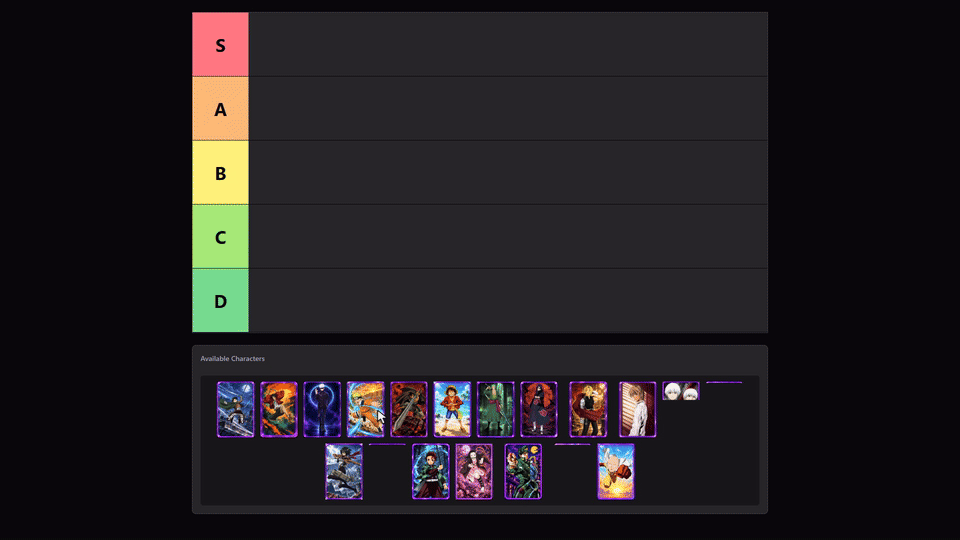

# Tier List Maker

A tiny side project I built to mess around with drag-and-drop again and get some React rust off.

Nothing revolutionary here - pick up some anime characters, throw them into tiers, reorder them, regret your rankings, move them again.

## Demo



## Why I built this

I mainly wanted to properly play around with the current `@dnd-kit/react` API instead of just watching someone else use it.

Life has been pretty busy lately with semester coming to an end, assignments, tests, my part-time job and everything else going on at once. Somewhere in between all of that I could feel myself getting a bit rusty with actually sitting down and coding things by hand.

So I ended up taking some time out late at night, usually when I probably should've been sleeping, and built this.

The app is intentionally small. Some parts might not be the absolute cleanest or most perfect implementation because, to be fair, I was probably half asleep while writing some of it 😭. But that wasn't really the goal here anyway. I just wanted to get my hands back on the keyboard, struggle through something myself, mess around with dnd-kit properly and get that coding rhythm back again.

Built with:

- React
- TypeScript
- Tailwind CSS
- `@dnd-kit/react`
- Bun

## The part that fought back

The first version looked simple enough: keep every card's current zone in state and update everything when the drag finished.

That worked... until it didn't.

Once sortable movement became more optimistic, React's state could fall behind what dnd-kit was already showing in the DOM. That eventually gave me some lovely `removeChild`, `insertBefore` and excessive update errors.

The cleaner model ended up being:

- card data only describes the card itself
- each drop zone owns the ordered list of card IDs inside it
- movement is synced during `onDragOver`
- same-tier reordering uses the card's current position, not where the drag originally started
- the drag overlay is kept separate from the original card

Once those pieces were in place, the whole thing became a lot less cursed.

## A few things I ended up caring about

Even for something this small, I wanted the interactions to feel decent:

- reorder cards inside the same tier
- move cards between tiers
- move cards back into the available pool
- let crowded tiers wrap instead of creating ugly horizontal scrollbars
- keep the original card faded while the drag overlay stays visible
- make the layout behave reasonably across my laptop and larger monitor

## Running it

```bash
bun install
bun run dev
```

Then open the local Vite URL in the browser.

## One last thing

I wrote the implementation hands-on because that was basically the whole point of this project.

I did use AI a little as a thinking sidecar when dnd-kit and I started disagreeing about reality, but I deliberately avoided turning this into a "generate the app for me" exercise.

Small project, but a pretty good reminder that even dragging a rectangle from A to B can become surprisingly interesting once state, ordering and multiple drop zones get involved.
